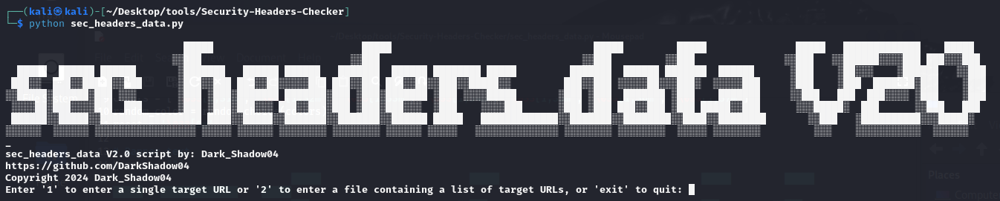

# Security-Headers-Checker: sec_headers_data

## Description

Security headers are a fundamental part of website security. Upon implementation, they protect you against the types of attacks that your site is most likely to come across. These headers protect against XSS, code injection, clickjacking, etc. This article explains most commonly used HTTP headers in context to application security

## Features

- **Header Analysis:** Checks for the presence of multiple security headers.
- **Description:** Provides a brief description of each security header.
- **Reporting:** Saves the results to a text file for further analysis.

## Installation

## Usage

1. **Clone the Repository:**
<pre><code>git clone https://github.com/DarkShadow04/Security-Headers-Checker.git</code></pre>
<pre><code>cd Security-Headers-Checker</code></pre>
<pre><code>chmod +x sec_headers_data.py</code></pre>

2. **Install Dependencies:**
Ensure you have Python installed. If not, download and install it from [here](https://www.python.org/downloads/).

4. **Run the Script:**
<pre><code>python sec_headers_data.py</code></pre>

## Usage

1. **Enter the Target URL:**
Provide the URL of the website you want to analyze.

2. **Review the Results:**
The script will check the security headers and save the results to a file named `security_headers.txt`.

## Example

<pre><code>python sec_header_data.py
Enter the target URL (e.g., https://example.com): https://www.example.com
Checking security headers for https://www.example.com...
[...]</code></pre>

## Security Headers Checked

- **Important** - Content-Security-Policy: Controls resources the user agent is allowed to load for a given page.
  - **Remediation:** Implement a Content Security Policy (CSP) to specify approved sources of content, helping to prevent XSS attacks.
  
- **Important** - X-Content-Type-Options: Prevents browsers from MIME-sniffing a response away from the declared content-type.
  - **Remediation:** Set the `X-Content-Type-Options` header to `nosniff` to prevent browsers from MIME-sniffing.

- **Important** - X-Frame-Options: Prevents your webpage from being put in an iframe.
  - **Remediation:** Implement `X-Frame-Options` with `DENY` or `SAMEORIGIN` to prevent clickjacking attacks.

- **Important** - X-XSS-Protection: Enables the Cross-site scripting (XSS) filter built into most recent web browsers.
  - **Remediation:** Enable the XSS filter by setting `X-XSS-Protection: 1; mode=block` to prevent XSS attacks.

- **Important** - Strict-Transport-Security: Instructs web browsers to access your website only over HTTPS.
  - **Remediation:** Implement HSTS with a long duration to ensure secure connections.

- **Important** - Referrer-Policy: Controls how much referrer information should be included with requests.
  - **Remediation:** Set an appropriate referrer policy to control referrer information leakage.

- **Very Important** - Feature-Policy: Allows web developers to selectively enable and disable use of various browser features.
  - **Remediation:** Implement Feature Policy to control what features and APIs can be used on the page.

- **Very Important** - Public-Key-Pins: Associates a specific cryptographic public key with a certain web server to decrease the risk of MITM attacks.
  - **Remediation:** Implement HPKP with caution, as misconfiguration can lead to lockout scenarios.

- **Necessary** - Expect-CT: Allows sites to opt in to reporting and/or enforcement of Certificate Transparency requirements.
  - **Remediation:** Implement Expect-CT to enforce Certificate Transparency.

- **Necessary** - Content-Security-Policy-Report-Only: Allows web developers to experiment with policies by monitoring (but not enforcing) their effects.
  - **Remediation:** Use Content-Security-Policy-Report-Only for testing before enforcing strict policies.

- **Necessary** - Access-Control-Allow-Origin: Indicates whether the response can be shared with requesting code from the given origin.
  - **Remediation:** Set the appropriate origin(s) for cross-origin resource sharing (CORS) to control access from different origins.

- **Necessary** - Access-Control-Allow-Methods: Indicates which HTTP methods are allowed on a particular endpoint.
  - **Remediation:** Specify the HTTP methods allowed for CORS requests to prevent unauthorized methods.

- **Necessary** - Access-Control-Allow-Headers: Indicates which headers can be used during the actual request.
  - **Remediation:** Define the headers allowed in CORS requests to control which headers can be sent by the client.

- **Optional** - Access-Control-Allow-Credentials: Indicates whether the response can be exposed when the credentials flag is true.
  - **Remediation:** Consider enabling this header if your application requires cookies or authentication information to be sent with cross-origin requests.

- **Optional** - Access-Control-Expose-Headers: Lets a server whitelist headers that browsers are allowed to access.
  - **Remediation:** Specify additional headers to be exposed to the client if needed.

- **Optional** - Access-Control-Max-Age: Indicates how long the results of a preflight request can be cached.
  - **Remediation:** Set an appropriate max age to optimize CORS performance and reduce unnecessary preflight requests.

- **Optional** - X-Permitted-Cross-Domain-Policies: Controls whether Flash and other plugins may access resources from other domains.
  - **Remediation:** Use this header to control cross-domain access for plugins if your website uses Flash or other plugins.

- **Optional** - Clear-Site-Data: Gives a web developer the ability to clear out a user’s local data for a particular website.
  - **Remediation:** Use this header to allow the user to clear site data when necessary, such as for GDPR compliance.

- **Important** - Content-Disposition: Indicates if the browser should display a save/download dialog for the response.
  - **Remediation:** Set the appropriate content disposition to control how the browser handles file downloads.

- **Important** - Cross-Origin-Opener-Policy: Allows a web page to opt into the same-origin policy.
  - **Remediation:** Use this header to control how pages can be opened from cross-origin contexts, improving security.

- **Very Important** - Cross-Origin-Embedder-Policy: Allows a web page to control whether and how a cross-origin document may embed itself.
  - **Remediation:** Implement this header to control how cross-origin documents can be embedded, enhancing security.

- **Very Important** - X-Content-Security-Policy: Controls resources the user agent is allowed to load for a given page.
  - **Remediation:** Similar to Content-Security-Policy, use this header to specify approved sources of content to prevent XSS attacks.

- **Optional** - X-DNS-Prefetch-Control: Controls DNS prefetching, which performs domain name resolution in the background.
  - **Remediation:** Use this header to control DNS prefetching behavior if it is not required for your website.

- **Important** - Content-Language: Specifies the language(s) of the intended audience for the enclosed content.
  - **Remediation:** Set the appropriate content language to improve accessibility and SEO.

- **Important** - Cache-Control: Tells all caching mechanisms from server to client whether they may cache this object.
  - **Remediation:** Set cache-control directives to control caching behavior and improve performance.

- **Important** - Expires: Gives the date/time after which the response is considered stale.
  - **Remediation:** Set the appropriate expiration date to control cache invalidation and improve performance.

- **Optional** - Pragma: Provides directives for cache handling in client-server communication.
  - **Remediation:** Use this header for backward compatibility with HTTP/1.0 clients, but it's generally not needed in modern web applications.

- **Important** - Report-To: Allows the server to specify where to send reports when a Content Security Policy violation is detected.
  - **Remediation:** Set the appropriate reporting endpoints to receive CSP violation reports and take necessary actions.

## Author

Script by: Dark_Shadow04 
GitHub: https://github.com/DarkShadow04 
© 2024 Dark_Shadow04
